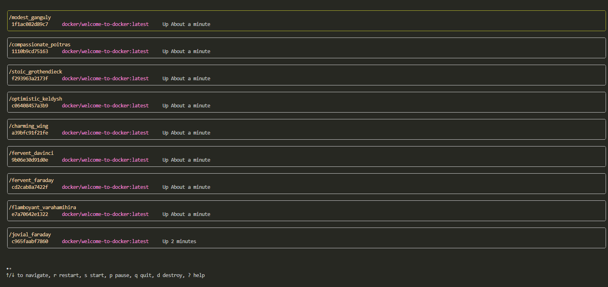

# Docmon
A basic Tui management of docker systems written in go.
This project uses Bubble tea for Tui and the Docker API

## List View

## TODO
- [x] Create List View for all Docker Containers
- [x] Controls to list view start, stop, restart, kill and destroy
- [ ] Add Container Output Viewports
- [ ] Add Container Creation
- [ ] Add Container Image Downloader/Installer
- [ ] Add Volumes viewer
- [ ] Add Volumes Creation/Deletion
- [ ] Add Configuration file for style and container access control